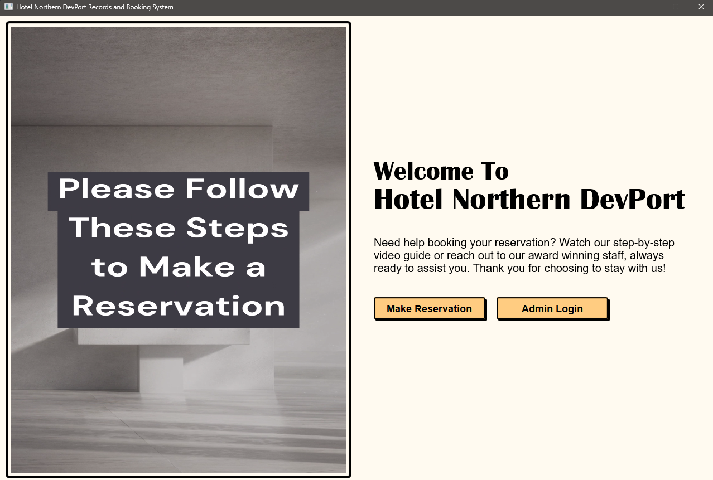
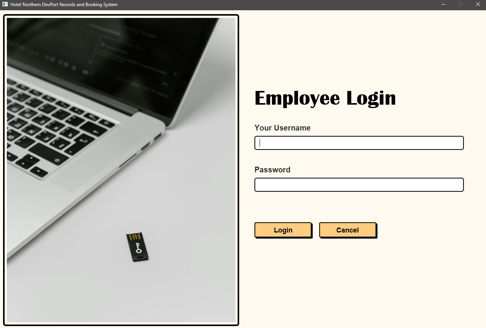
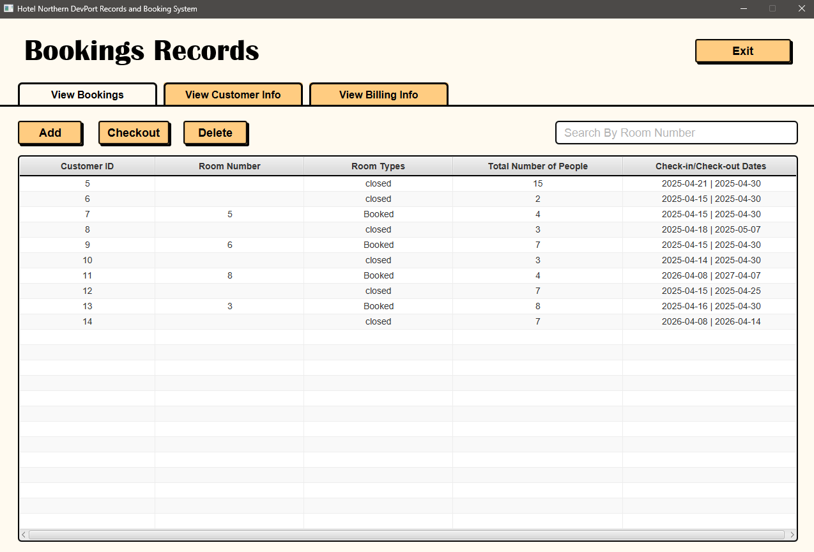
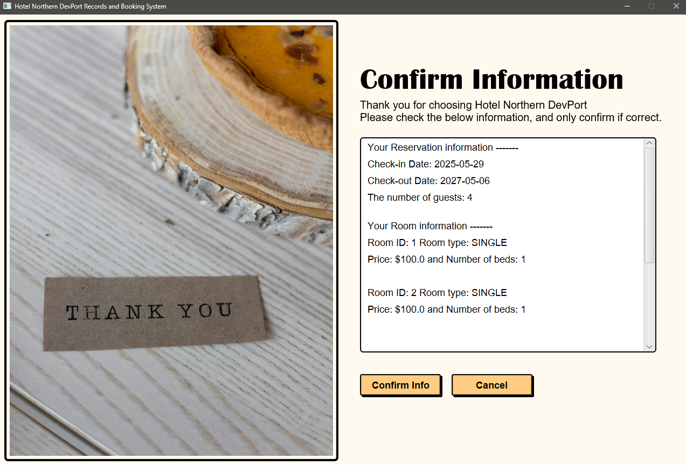

# Hotel Reservation Desktop Application

### About The App

The Hotel reservation app is a local desktop based application which attempts to simulate an 
early 90s style hotel reservation system. As such, it has no connectivity to 
the internet in any way, instead choosing to store data inside a file based SQLite 
database. The app employs a clean pastel color palette, simple readable font, and a minimalist 
style for its UI/UX design. During development, the JavaFX API along with a drag-and-drop 
UI builder known as scene builder, was used to create the frontend fxml files. Meanwhile, 
simple Java code, in conjunction with the JavaFX API constructed and connected the 
backend to the frontend, while also creating a JDBC SQLite connection to store data.

The reason for building this software was to explore the interconnectivity between 
various components of a light-weight desktop app. It asks questions like; how does the 
frontend and backend connect? what programming paradigm is most efficient? and more 
importantly how is data stored, updated, and read in such an application?

### Some Screenshots

### Project Structure

The project uses the MVC architecture to modularize the code. Since the project is self-contained, it 
opts for a file structure which allows all application elements to remain within the
reach of the src folder. This way the app can operate as a true platform independent software.
- views folder: contains the FXML files
- media folder: contains any images, videos, or other media files
- styles folder: has only CSS files
- models folder: has data classes only
- utils folder: contains classes used for more than just holding data
- controller: contains any and all controller classes
